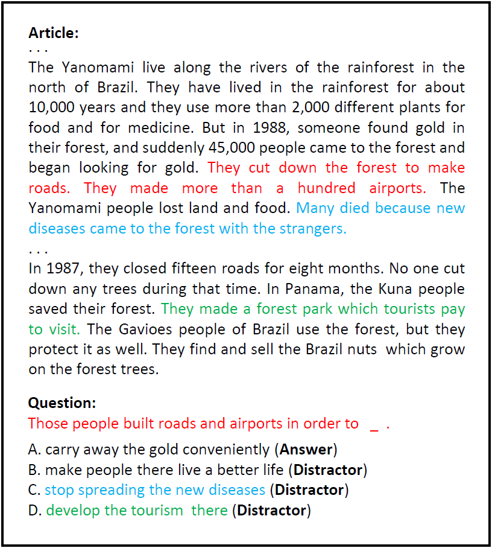
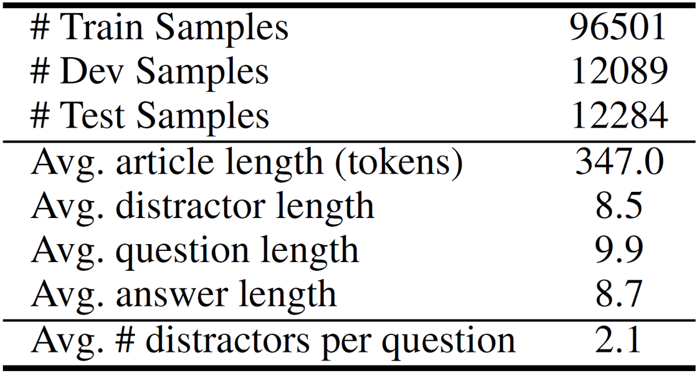

# Distractor-Generation-RACE
Implementation for our AAAI 2019 paper: Generating Distractors for Reading Comprehension Questions from Real Examinations https://arxiv.org/abs/1809.02768

If you use our data or code, please cite our paper as follows:
```tex
@inproceedings{gao2019distractor,
	title="Generating Distractors for Reading Comprehension Questions from Real Examinations",
	author="Yifan Gao and Lidong Bing and Piji Li and Irwin King and Michael R. Lyu",
	booktitle="AAAI-19 AAAI Conference on Artificial Intelligence",
	year="2019"
}
```

## Distractor Generation: A New Task
In the task of Distractor Generation (**DG**), we aim at generating reasonable `distractors` (wrong options) for multiple choices questions (MCQs) in reading comprehension.

The generated distractors should:
- be longer and *semantic-rich*
- be *semantically related* to the reading comprehension question
- *not be paraphrases* of the correct answer option
- be *grammatically consistent* with the question, especially for questions with a blank in the end

Here is an example from our dataset. The question, options and their relevant
sentences in the article are marked with the same color.

<p align="center">
  
</p>

#### Real-world Applications
- Help the preparation of MCQ reading comprehension datasets
    - The existence of distractors fail existing content-matching SOTA reading comprehension on MCQs like RACE dataset (Lai et al. 2017)
    - Large datasets can boost the performance of MCQ reading comprehension systems
- Alleviate instructors' workload in designing MCQs for students
    - Poor distractor options can make the questions almost trivial to solve
    - Reasonable distractors are time-consuming to design

## Dataset
The data used in our paper is transformed from [RACE Reading Comprehension Dataset](http://aclweb.org/anthology/D17-1082).
We prune the distractors which have `no semantic relevance` with the article or require some `world knowledge` to generate.

The processed data is put in the `/data/` directory. Please uncompress it first.

Here is the dataset statistics.

<p align="center">
  
</p>

## Run our model
- The code will be released in March 2019. More details will be released then.